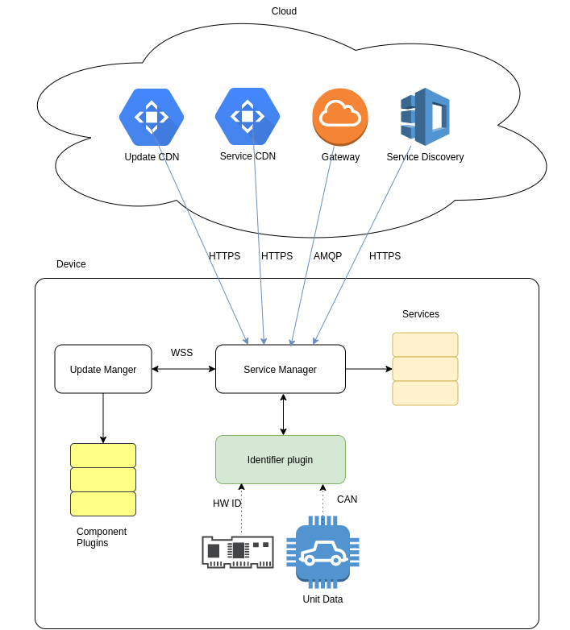
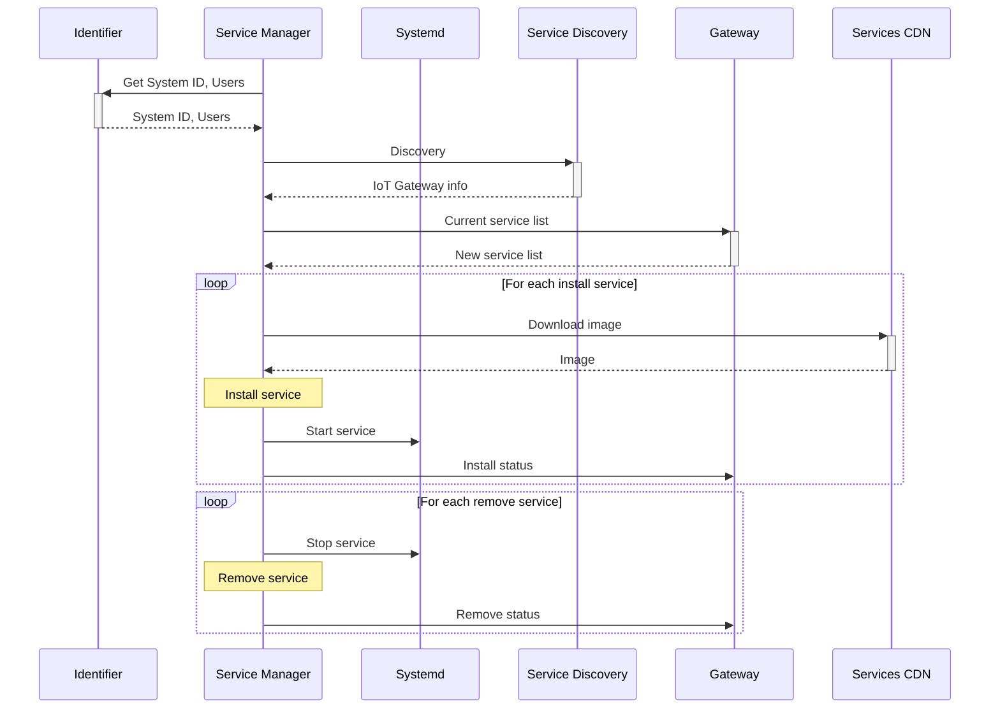

# AOS Architecture

## Block diagram

Devise contains following AOS components:
* AOS Service Manager (SM):
    * communicate with cloud
    * handle services life cycle
    * downloads and validates system update image

See [SM architecture](doc/servicemanager.md), documents for more details. 

On the unit side, SM interacts with the Identifier plugin in order to get unit systemID and current Users.  SM receives notification from identifier when Users changed. When it happens SM reconnects to the cloud with new parameters.

On the cloud side, SM communicates with:
* Service Discovery - to get Getaway connection info
* Gateway - to handle main exchange protocol
* Services CDN - to download service images

## Startup sequence

Startup sequence shows basic communication between different AOS parts:

