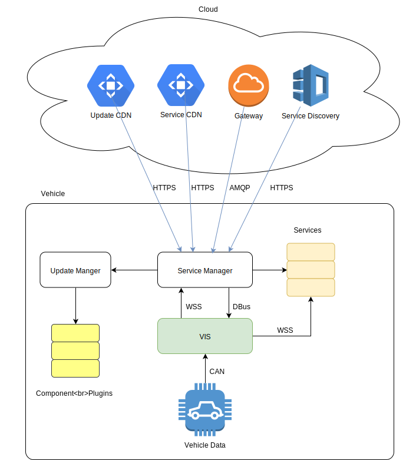
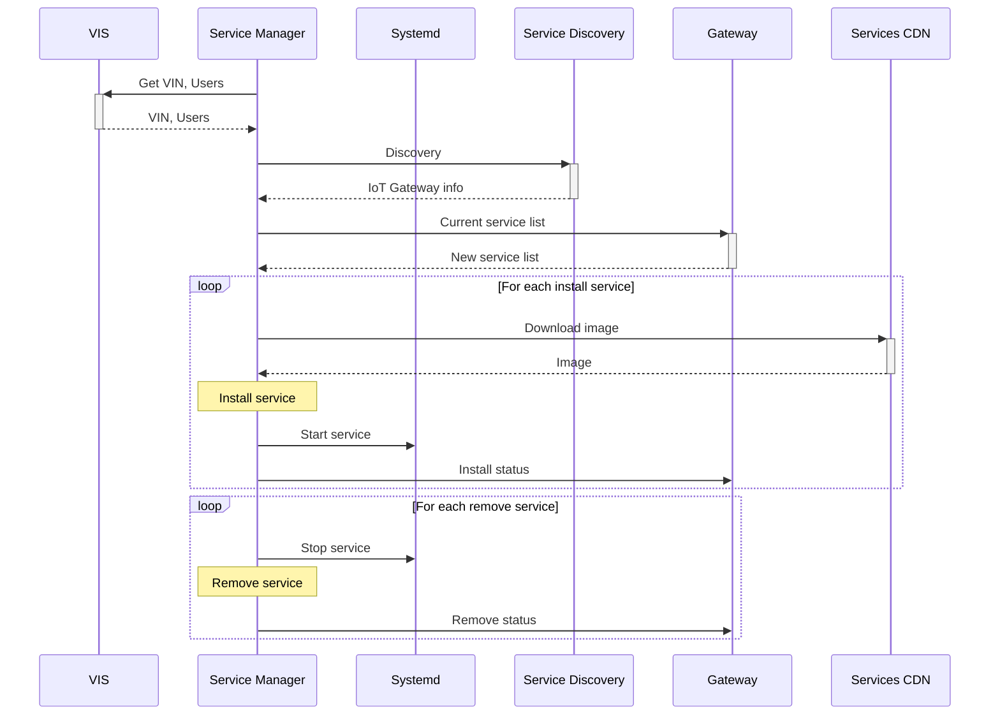

# AOS Architecture

## Block diagram

Vehicle contains following AOS components:
* AOS Service Manager (SM):
    * communicate with cloud
    * handle services life cycle
    * provides VIS permissions for VIS clients
    * downloads and validates system update image
* AOS VIS (VIS):
    * provides access to the vehicle data
* AOS Update Manager (UM):
    * applies updates for different system components

See [SM architecture](doc/servicemanager.md), [VIS architecture](), [UM architecture]() documents for more details. 

On the vehicle side, SM interacts with VIS in order to get vehicle VIN and current Users. This is done through WSS protocol. SM receives notification from VIS when Users changed. When it happens SM reconnects to the cloud with new parameters. VIS is connected with SM through D-Bus to get VIS permissions for VIS clients.

On the cloud side, SM communicates with:
* Service Discovery - to get Getaway connection info
* Gateway - to handle main exchange protocol
* Services CDN - to download service images

## Startup sequence

Startup sequence shows basic communication between different AOS parts:

