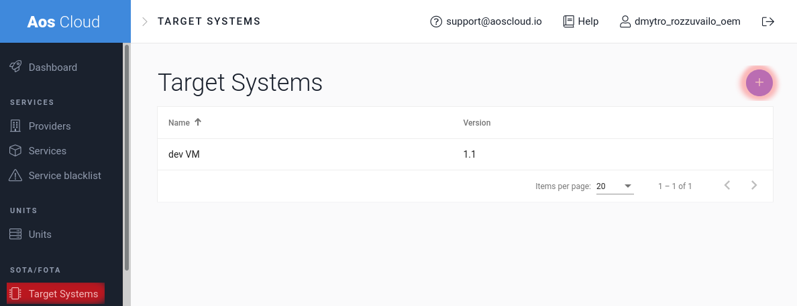
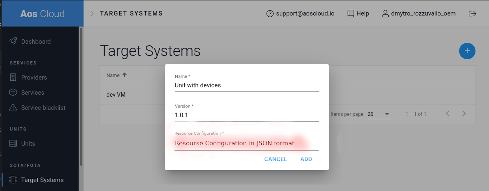
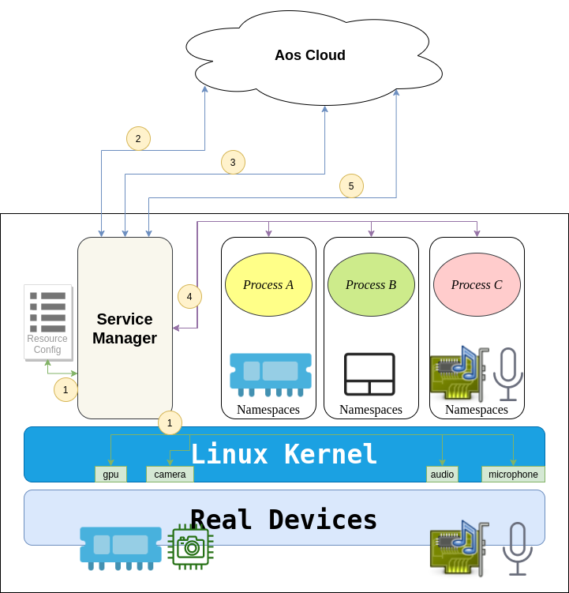
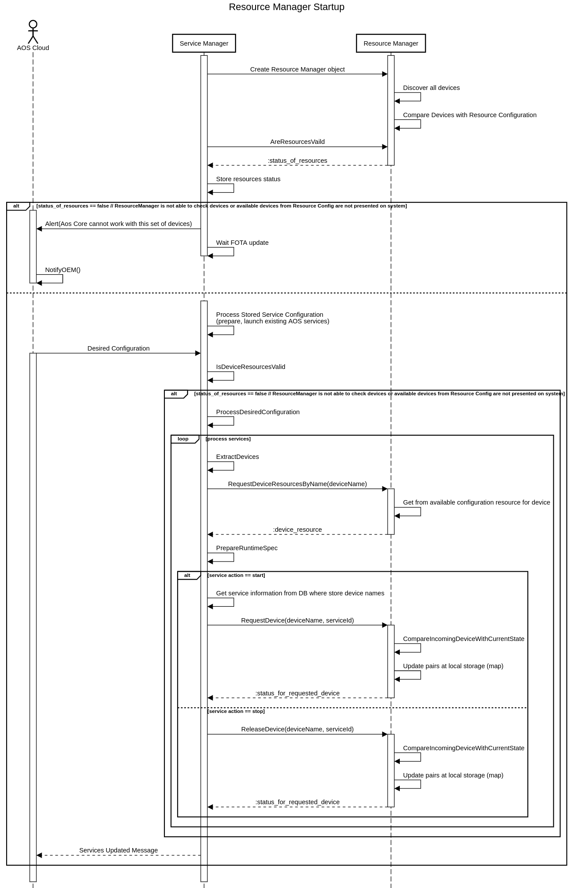

# Resource Management

This functionality responses for proper providing system resources such as devices, RAM, CPU, etc for AOS services.

This document describes resource management for devices.

## Resource configuration

This configuration contains list of available system resources such as devices, RAM, CPU, etc.
<p align="center"></p>

1. Create *Resource Configuration* of system in *JSON* format
```json
{
    "cpu": {...},
    "ram": {...},
    ...
    "devices": [
        {
            "name": "camera0",   /// name of device (alias) (device is addressed in linux way:camera0, camera1 etc.)
            "sharedCount": 0,    /// 0 - device can be shared with unlimited containers
            "groups": [          /// SM should share these additional groups to container
                "user1",
                "user2"
            ],
            "hostDevices": [     /// This node contains paths to real devices on Host system
                "/dev/video0",   /// they should be used for providing this Device Class to container
                "/dev/video1"    /// Path to real device descriptor on Host system
            ]
        },
        {
            "name": "mic0",
            "sharedCount": 1,   /// only one container can use this device
            /// groups can be empty or isn't presented. It means that SM should not share additional groups
            "hostDevices": [
                    "/dev/snd/controlC0",
                    "/dev/snd/pcmC0D0c",
                    "/dev/snd/timer"
            ]
        },
        {
            "name": "audio0",
            "sharedCount": 0,    /// 0 - device can be shared with unlimited containers
            "groups": [
                "user1"
            ],
            "hostDevices": [
                "/dev/snd/controlC0",
                "/dev/snd/pcmC0D0p",
                "/dev/snd/timer"
            ]
        },
        {
            "name": "gpu0",
            "sharedCount": 4,  /// four continaers can use it
            "hostDevices": [
                "/dev/dri/card0",
                "/dev/dri/renderD128"
            ]
        }
    ]
}
```

2. Attach this configuration with specific target system

It should be created at step of creation new target system:
- go to *AOS Cloud*
- switch to *Target System* menu and *Add* new system
<p align="center"></p>

- Enter *Name*, *Version* and *Resource Configuration* of devices
<p align="center"></p>

3. Provide this *configuration* to Units

Resource configuration should be provided to **Unit** on [provisioning state](https://kb.epam.com/display/EPMDAEPRA/Provisioning+-+unit+side). It means that provisioning script should download provided to AOS Cloud **resource configuration** and put it to Unit as */var/aos/resources/available_configuration.cfg* file.

4. Update **Resource Configuration**

Update of resource configuration file is done using SOTA/FOTA mechanism. After uploading updated configuration to cloud, the backend generates next update bundle:

```text
update_bundle.tar.gz
├── metadata.json
└── resource_config_update
    ├── metadata.json
    └── device_config.gz
```

Where top metadata.json

```json
{
    "platformId": "AOS",
    "bundleDescription": "Device resource configuration update",
    "updateItems": [{
        "type": "resourceconfig",
        "path": "./resource_config_update"
    }]
}
```

Where top metadata.json inside resource_config_update:

```json
{
    "componentType": "resourceconfig",
    "resources": [{
        "id": "deviceconfig",
        "resource": "deviceConfig.gz"
    }]
}
```

After updating the configuration AOS services manager should be restarted for being able to process all available resources on startup and stop or remove incompatible services.

## Device Management

It is a part of *Resource Management* subsystem.

This functionality responses for proper providing access to hardware devices at AOS services. It is based on [whitelisting](https://en.wikipedia.org/wiki/Whitelisting) approach. It means that OEM provides list of devices that can be used by AOS services, all other devices are forbidden.

Management system should handle this access on Backend and on Core sides.

### Device management on Backend

Backend should process *Resource Configuration* and handle requests from SP on adding device to AOS service.
SP need to add necessary devices to [aos_container.yaml](https://kb.epam.com/display/EPMDAEPRA/aos_container.yml).

Description of nodes:
```yaml
...
    # Requested devices
    devices:
        - name : string (camera, mic, audio)
          # the container will be able to `read`, `write`, and `mknod` these devices
          mode  : rwm
```
for example
```yaml
...
    # Requested devices
    devices:
        - name : camera0
          mode  : r
    # gpu may include several devices at HW rootfs (/dev/...)
        - name : gpu0
          mode  : rw
```
- Store *Resource Configuration* that can be provided on init target system
- Provide this file on provisioning
- Handle update process of *Resource Configuration* (upload new version, show at frontend available devices, etc)
- Create proper [Aos Service configuration](https://kb.epam.com/display/EPMDAEPRA/aos_service_config.json).
  Devices' node should correspond for aliases that used at [aos_container.yaml](https://kb.epam.com/display/EPMDAEPRA/aos_container.yml):
```json
{
    ...
    "devices": [
        {
            "name": "camera0",
            "permissions": "r"
        },
        {
            "name": "gpu0",
            "permissions": "rwm"
        }
    ]
}
```

### Device management on Unit

Resource manager should:
- Prepare list of connected hw device by checking **/dev/** directory. This directory should already contain device's name in common convention (*micN, cameraN, audioN, gpuN*) that prepare on startup by *udev custom rules*
- Compare real devices with *available devices* from *resource configuration*.
  - If some of devices are not presented at real system SM should send [Alert](https://kb.epam.com/display/EPMDAEPRA/Alerts+message) message to Cloud. This message should contains list of failed devices and their reasons.
  - The service manager should continue its functionality but with limitation on process services only update should be available.
```json
{
    "version": 1,
    "messageType": "alerts",
    "data": [
        {
            "tag": "aosCore",
            "source": "servicemanager",
            "payload": {
                "type": "deviceErrors",
                "message": [
                    {
                        "name": "camera0",
                        "errors": [
                            "Device is not presented on System",
                            "Group is not presented on System"
                        ]
                    },
                    {
                        "name": "gpu0",
                        "errors": [
                            "Driver issue. It cannot be used"
                        ]
                    }
                ]
            },
            "timestamp": "2020-06-11T16:16:38.581175Z"
        },
        ...
    ]
}
```
- Process Desired configuration on provided devices (perform all necessary checks and parse json)
- Check that devices are available (in system and free to use) for each requested service if all devices are occupied then service should not be started and [Alert](https://kb.epam.com/display/EPMDAEPRA/Alerts+message) message (*tag*: **aosCore**, *source*: **service ID**) to Cloud
- Prepare runtime-spec with [devices node]([devices](https://github.com/opencontainers/runtime-spec/blob/master/config-linux.md#devices)) for services
- Launch services and save in DB status of devices
- Send to Backend [Unit Status Message](https://kb.epam.com/display/EPMDAEPRA/Unit+Status+Message)

#### SM's Resource Manager

Resource manager component is a part of Service Manager and responsible for managing devices and other system resources (CPU, RAM, etc) on Unit side.

##### Flow diagram

Below you can find flow diagram where shown comunication between AOS Cloud and AOS Core according to devices.

<p align="center"></p>

1. Resource Manager discovers all connected devices and check them with stored and with *availabe of devices* from *resource configuration*
2. Request [Unit Status Message](https://kb.epam.com/display/EPMDAEPRA/Unit+Status+Message). SM sends status of all existing environment (services, layers) on response
3. Desired Configuration that contains 3 services with used devices. SM checks request on available devices at DB and generate all necessary files for running services as OCI containers
4. SM launches all services as OCI containers with requested devices
5. SM sends [Unit Status Message](https://kb.epam.com/display/EPMDAEPRA/Unit+Status+Message) that contains status of all existing environment (services, layers)

##### Sequence diagram

<p align="center"></p>

##### Resource Manager API (Devices)

Device discovery will be performed on Resource Manager initialization or creating.
ResourceManager is the ServiceManager's module with the following API:
```go
// Check status of available devices from resources configuration with host (real) devices
AreResourcesValid() (err error)

// DeviceResource describes Device available resource
type DeviceResource struct {
	Name        string   `json:"name"`
	SharedCount int      `json:"sharedCount,omitempty"`
	Groups      []string `json:"groups,omitempty"`
	HostDevices []string `json:"hostDevices"`
}

// Provide device resources by name (alias from aos service configuration)
RequestDeviceResourceByName(name string) (deviceResource DeviceResource, err error)

// Request Device by name for service id
// Return Error in case there is no available devices
RequestDevice(device string, serviceID string) (err error)

// Request release device for service id
// Return Error in case divice is already released for this service id
ReleaseDevice(device string, serviceID string) (err error)
```

This API will be called by **launcher** on service start and stop accordingly.

The Resource Manager should maintain the number of requested devices and compare it with *available devices* from *resource configuration*.

## Example of real Available devices

Here is a list of resource configuration for real devices
```json
{
    "devices": [
        {
            "name": "camera0",
            "sharedCount": 1,
            "groups": [
                "plugdev"
            ],
            "hostDevices": [
                "/dev/video0",
                "/dev/video1"
            ]
        },
        {
            "name": "camera1",
            "sharedCount": 1,
            "groups": [
                "plugdev"
            ],
            "hostDevices": [
                "/dev/video2",
                "/dev/video3"
            ]
        },
        {
            "name": "camera2",
            "sharedCount": 1,
            "groups": [
                "plugdev"
            ],
            "hostDevices": [
                "/dev/video4",
                "/dev/video5"
            ]
        },
        {
            "name": "audio0",
            "sharedCount": 1,
            "groups": [
                "audio"
            ],
            "hostDevices": [
                "/dev/snd/controlC0",
                "/dev/snd/pcmC0D0p",
                "/dev/snd/timer"
            ]
        },
        {
            "name": "mic1",
            "sharedCount": 1,
            "groups": [
                "audio"
            ],
            "hostDevices": [
                    "/dev/snd/controlC1",
                    "/dev/snd/pcmC1D0c",
                    "/dev/snd/timer"
            ]
        },
        {
            "name": "audio1",
            "sharedCount": 1,
            "groups": [
                "audio"
            ],
            "hostDevices": [
                "/dev/snd/controlC1",
                "/dev/snd/pcmC1D0p",
                "/dev/snd/timer"
            ]
        },
        {
            "name": "mic2",
            "sharedCount": 1,
            "groups": [
                "audio"
            ],
            "hostDevices": [
                    "/dev/snd/controlC2",
                    "/dev/snd/pcmC2D0c",
                    "/dev/snd/timer"
            ]
        },
        {
            "name": "audio2",
            "sharedCount": 1,
            "groups": [
                "audio"
            ],
            "hostDevices": [
                "/dev/snd/controlC2",
                "/dev/snd/pcmC2D0p",
                "/dev/snd/timer"
            ]
        },
        {
            "name": "tpm0",
            "hostDevices": [
                "/dev/tpmrm0",
            ]
        },
        {
            "name": "touchscreen0",
            "sharedCount": 1,
            "groups": [
                "input"
            ],
            "hostDevices": [
                "/dev/input/event2",
            ]
        },
        {
            "name": "screen0",
            "sharedCount": 1,
            "hostDevices": [
                "/dev/dri/card0",
                "/dev/dri/renderD128"
            ]
        },
        {
            "name": "gpu0",
            "sharedCount": 1,
            "hostDevices": [
                "/dev/dri/card0",
                "/dev/dri/renderD128"
            ]
        }
    ]
}
```