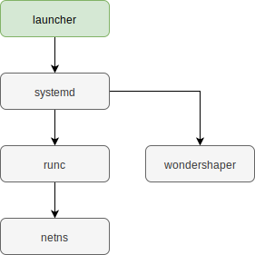

# Launcher

Launcher stands for following functionality:
* install service
* remove service
* provide installed service info
* handle service [state](doc/state.md)

It uses external tools to manage AOS services:
* `systemd` - start, stop, automatic restart of AOS services
* `runc` - run services in separate containers
* `netns` - provide network connection for service containers
* `wondershaper` - limit service in/out traffic speed

## User claim

On initialization, launcher gets current user claim from Identifier plugin and start all services connected with this claim. If user claim is changed during operation, launcher stops current claim services and starts services connected to new claim. For all user claims required the service, there is only one service instance in the system. If the backend installs service which already exists in the system but for new user claim, the service will not be installed but existing one will be started. When the backend removes service for current claim, it is not removed but stopped and disconnected from this claim.

## Install service

All time consuming actions (currently install and remove service) are performed asynchronously with the action handler. The action handler performs defined number of actions (10) in parallel. Other incoming actions are put into the wait queue and processed when there is a room in the working queue.

Install service flowchart:

Do install actions:
* create unique folder name in service directory (service folder)
* download and unpack service image into service folder
* create system service user (do not mixup with user claim)
* update config.json
    * set UID, GUI of service user
    * mount system files and folders (see [resource management](doc/resource_management.md))
    * set `netns` to the prestart hook (setup network)
    * create systemd service file
    * set disk user quota
    * start systemd service
    * remove previous service version (if exists)

## Remove service

On service remove, launcher stops the requested service and disconnects it form current user claim. The service is removed only if it wasn't started during defined period of time (TTL). On service start, launcher saves start time into service database. Then, on each user claim change, launcher check all services start time. If service TTL exceeds, this service is removed from the system.