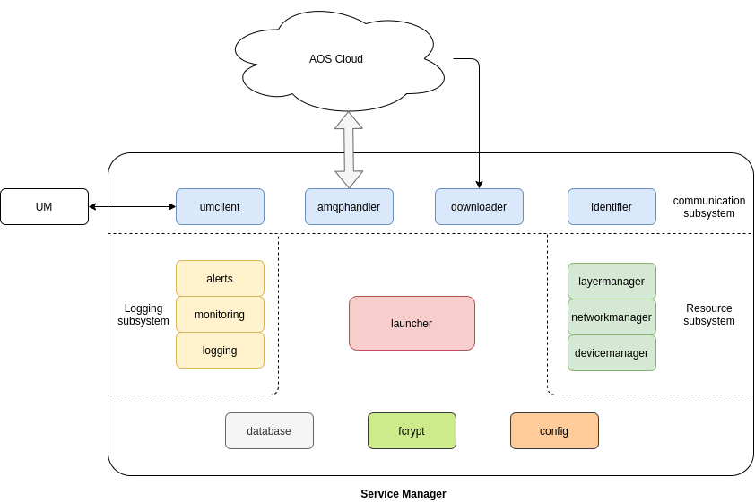

# AOS Service Manager architecture

AOS Service Manager contains following packages:
* [config](doc/config.md) - provides configuration for all SM packages
* [downloader](doc/downloader.md) - perform download of the aos services, layers, update packages
* fcrypt - used by downloader packages and amqphandler to encrypt/decrypt data  
* [database](doc/database.md) - stores local services configuration description
* [amqphandler](doc/amqphandler.md) - handles communication with IoT Gateway
* [launcher](doc/launcher.md) - installs/removes AOS services and manages their life cycle
* [monitoring](doc/monitoring.md) - monitors system and AOS services resource usage
* [alerts](doc/alerts.md) - sends different kind of alerts to the cloud
* [logging](doc/logging.md) - provides systemd and services log to the cloud
* [devicemanager](devicemanager.md) - system resources such as devices, RAM, CPU, etc for AOS service    

