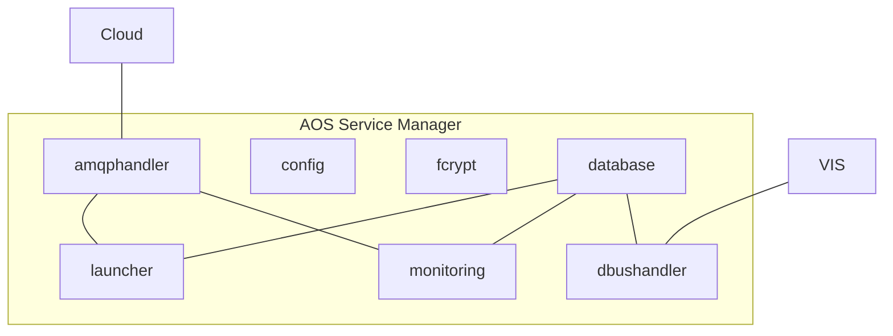

# AOS Service Manager architecture

AOS Service Manager contains following packages:
* [config](doc/config.md) - provides configuration for all SM packages
* fcrypt - used by other packeges to encrypt/decrypt data
* [database](doc/database.md) - stores local services configuration
description
* [amqphandler](doc/amqphandler.md) - handles communication with IoT Gateway
* launcher - installs/removes AOS services and manages their life cycle
* monitoring - monitors system and AOS services resource usage
* [dbushandler](doc/dbushandler.md) - provides VIS client permissions

