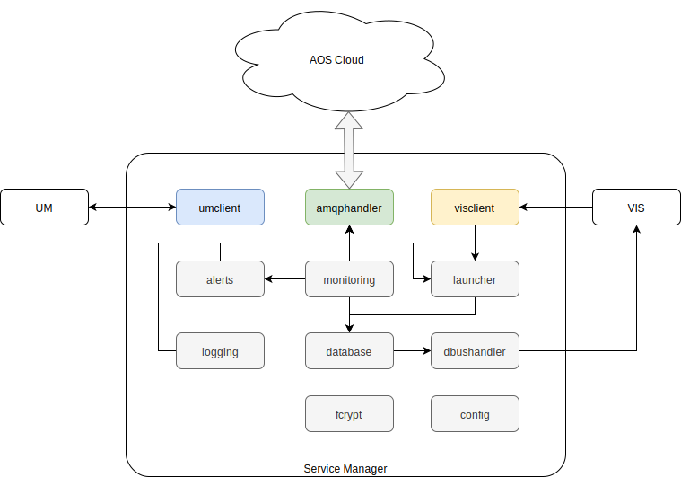

# AOS Service Manager architecture

AOS Service Manager contains following packages:
* [config](doc/config.md) - provides configuration for all SM packages
* fcrypt - used by other packages to encrypt/decrypt data
* [database](doc/database.md) - stores local services configuration description
* [amqphandler](doc/amqphandler.md) - handles communication with IoT Gateway
* [launcher](doc/launcher.md) - installs/removes AOS services and manages their life cycle
* [monitoring](doc/monitoring.md) - monitors system and AOS services resource usage
* [alerts](doc/alerts.md) - sends different kind of alerts to the cloud
* [logging](doc/logging.md) - provides systemd and services log to the cloud
* [dbushandler](doc/dbushandler.md) - provides VIS client permissions
* [visclient](doc/visclient.md) - provides access to VIS in order to get user claim and VIN
* [umclient](doc/umclient.md) - downloads and validates the update image and communicates with the update manager (UM)

