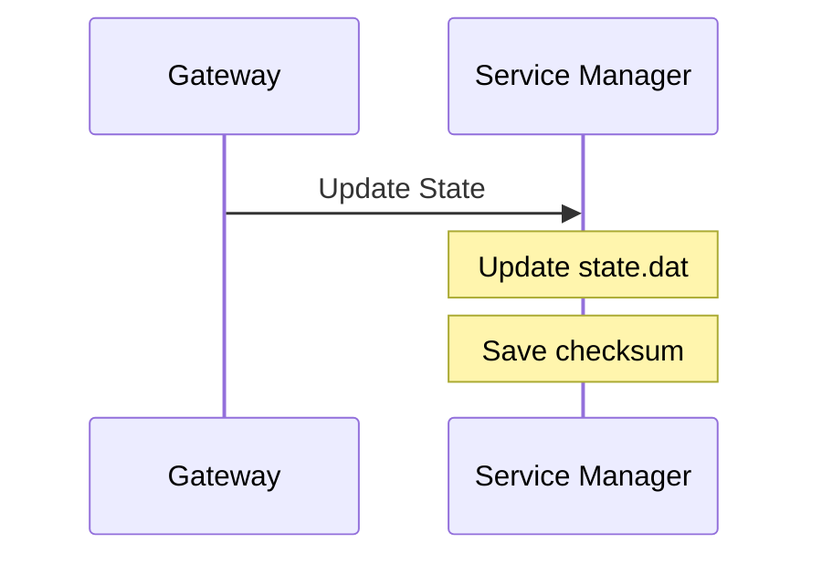
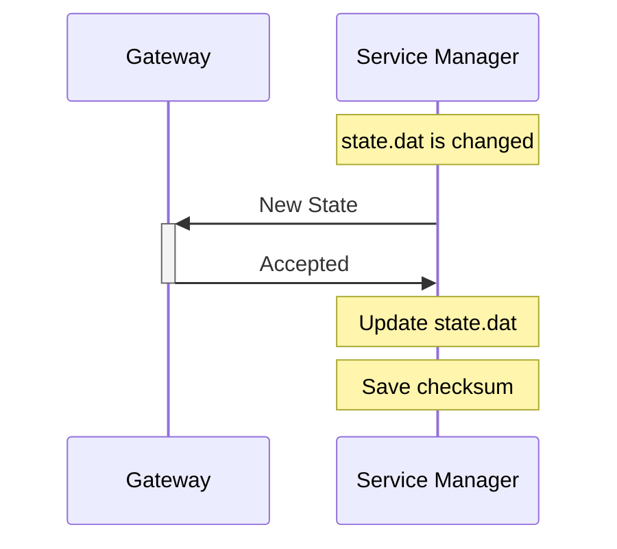
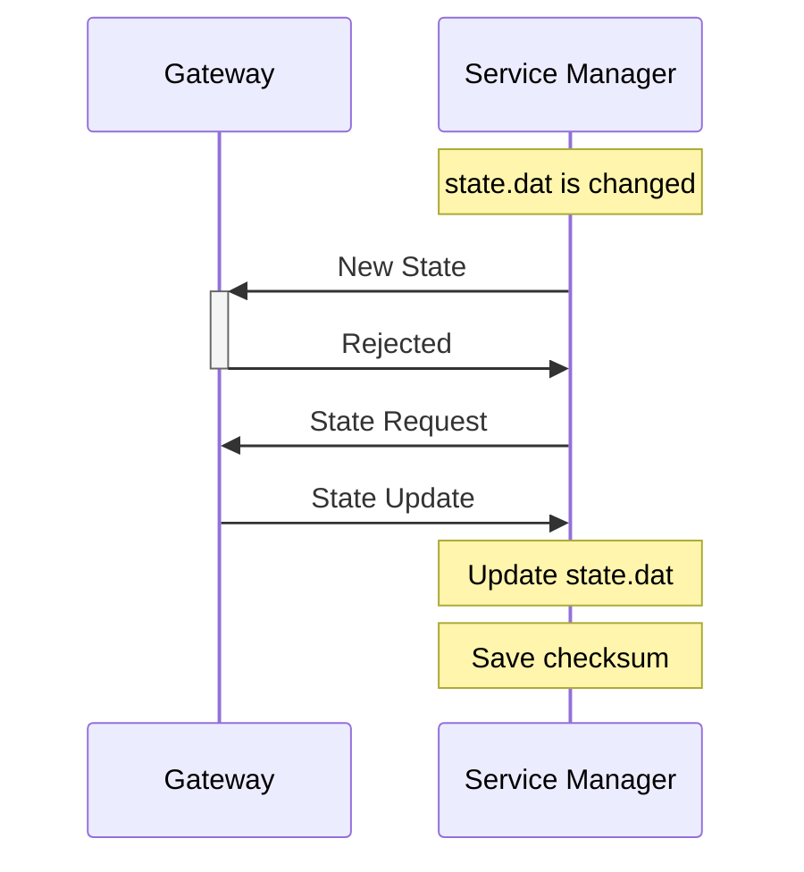

# Service storage and state

# Service storage

AOS Service Manager (SM) provides a persistent storage for AOS services in order to store any persistent information. It is done by mounting the storage folder. Storage folders are located separately (`<working_dir>/storages`) from the service image in order to keep the storage between service update. Each service claim has its own storage folder. When service is removed for current user claim, its storage folder removed too. The size of service storage are limited by (resource management)[doc/resource_management.md] and shared between all service user claims.

In order to use service storage, disk quotas should be enabled on the `<working_dir>` disk partition. See http://souptonuts.sourceforge.net/quota_tutorial.html as example how to enable disk quotas.

Disk quotas limits disk usage with FS block size granularity. For more precise limitation we should format `<working_dir>` disk partition with 1k block size.

On service install, `launcher` checks if service storage is enabled and 
set disk quota for service user. Then, before each service start, `launcher` updates `config.json` in order to mount storage folder according to user claim.

# Service state

In order to handle the service settings, AOS provide states mechanism.  The state is an data which can be updated from the cloud or locally by the service itself. The state data is stored in the service storage folder as `state.dat` file. The state file size is limited by (resource management)[doc/resource_management.md].

The state can be updated from the cloud with `update state` message. If the state is changed locally by the service, SM should upload it to the cloud with `new state` message. SM also may request last valid or default service state from the cloud by sending `state request` message (currently this scenario is not implemented TBD). 

`launcher` watches for each running service state file and, in case it is changed, sends new state request to the cloud. As the file may be written by chunks, `launcher` starts special watch timer (1 sec) once change is detected. New state is sent when there is no other changes during timer interval.

If the cloud rejects new state, `launcher` sends state request to get last valid service state.

`launcher` stores checksum of each successfully updated state. If, on the service start, `launcher` detects wrong state checksum, it treats this state as corrupted and sends state request to the cloud.

Update state from the cloud:

New state accepted:

New state rejected:

