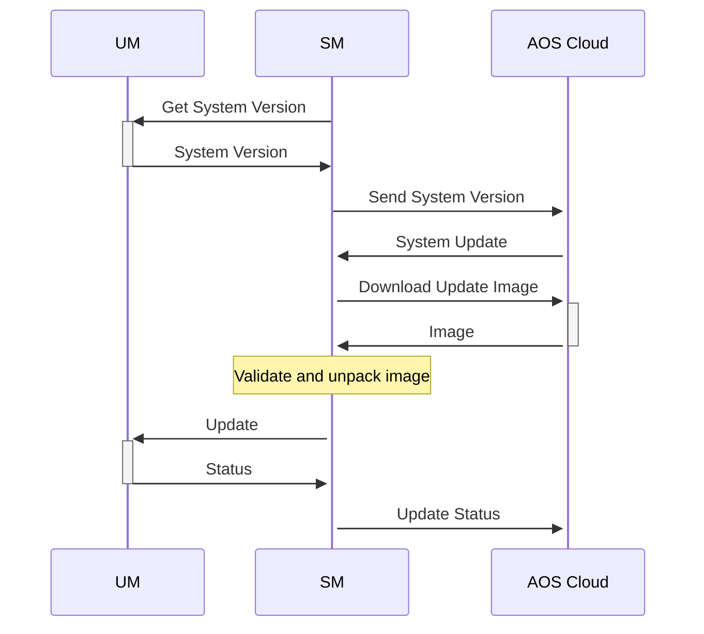
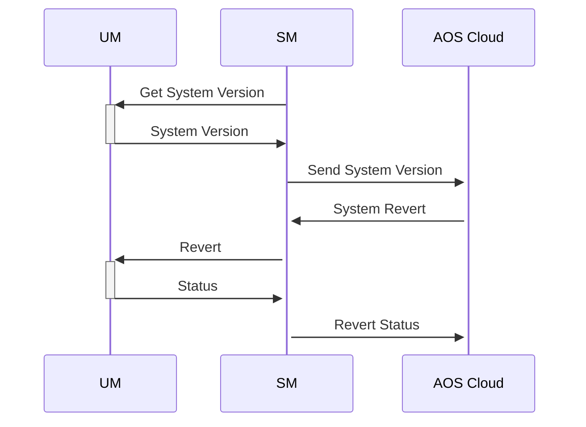

# UM Client

UM Client provides API to communicate with Update Manager (UM). The main function of UM Client:
* downloads, validates and unpacks the update image
* request UM for systemd update/revert
* provides status of update/revert to the AOS cloud

Sequence diagram of system update:

Sequence diagram of system revert:

