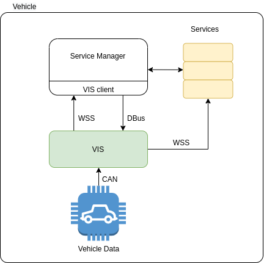

# Vehicle data access

AOS system is able to provide access to the vehicle CAN data via [W3C Vehicle Information Service Specification](https://www.w3.org/TR/vehicle-information-service/)

* AOS Service Manager (SM):    
    * provides VIS permissions for VIS clients
* AOS VIS (VIS):
    * provides access to the vehicle data



On the vehicle side, SM interacts with VIS in order to get vehicle VIN and current Users. This is done through WSS protocol. SM receives notification from VIS when Users changed. When it happens SM reconnects to the cloud with new parameters. VIS is connected with SM through D-Bus to get VIS permissions for VIS clients.

VIS client communicates with VIS server to provide VIS data to SM. At the start VIS client gets VIN and user claims from VIS server. These info is used to authenticate with AOS cloud. Also VIS client subscribes on user claims change notification in order to reconnect to AOS cloud in case user claims are changed runtime.

[VIS architecture](https://kb.epam.com/display/EPMDAEPRA/Unit+Information+access)

`dbushandler` is a part of vis client and implements D-Bus server which provides VIS client permissions. The permissions is provided with AOS service image during service install and stored in the SM database.

`dbushandler` supports following methods:
* `GetPermissions` - returns permissions by client token (service id). On this request `dbushandler` get permissions from the database and return to the D-Bus client (VIS).

D-Bus retrospect file implemented by `dbushandler`:

```xml
<!DOCTYPE node PUBLIC
    "-//freedesktop//DTD D-BUS Object Introspection 1.0//EN"
    "http://www.freedesktop.org/standards/dbus/1.0/introspect.dtd" >
<node xmlns:doc="http://www.freedesktop.org/dbus/1.0/doc.dtd">
  <interface name="com.epam.aos.vis">
    <method name="GetPermissions">
      <arg name="token" direction="in" type="s">
        <doc:doc><doc:summary>VIS client token (service id)</doc:summary></doc:doc>
      </arg>
      <arg name="permissions" direction="out" type="s">
        <doc:doc><doc:summary>VIS client permissions</doc:summary></doc:doc>
      </arg>
      <arg name="status" direction="out" type="s">
        <doc:doc><doc:summary>Status of getting VIS permissions: OK or error</doc:summary></doc:doc>
      </arg>
      <doc:doc>
        <doc:description>
          <doc:para>
            Returns VIS client permission
          </doc:para>
        </doc:description>
      </doc:doc>
    </method>
  </interface>
</node>
```